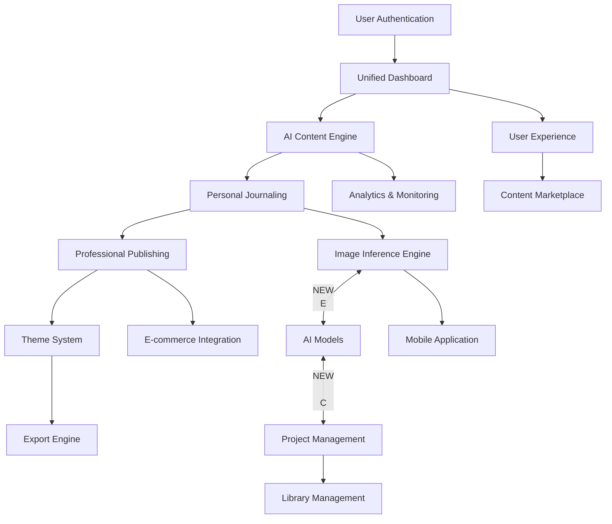

# Journal Craft Crew - Aligned Implementation Strategy
## Unified Vision: AI-Powered Journaling Platform
**Aligning all components into cohesive development plan**

---

## 🎯 **EXECUTIVE SUMMARY OF ALL PROPOSALS**

### **Current Assets Inventory**
```
✅ EXISTING AI AGENT SYSTEM (80% Complete)
├── Manager Agent - Multi-agent orchestration
├── Content Curator - 30-day journal creation
├── PDF Builder - Professional output generation
├── Media Agent - Image generation (placeholder stage)
├── Discovery/Research Agents - Content research
└── Editor Agent - Content polishing

✅ MODERN BACKEND FOUNDATION (90% Complete)
├── FastAPI application with async architecture
├── PostgreSQL database with SQLAlchemy ORM
├── JWT authentication system
├── Project/Theme/Export API endpoints
├── Comprehensive testing suite
├── Docker development environment

✅ MODERN FRONTEND FOUNDATION (70% Complete)
├── React 18+ with TypeScript
├── Tailwind CSS theming system
├── Core UI components (Button, Card, Header, etc.)
├── Optimized production builds (251KB JS, 18KB CSS)
├── Responsive design architecture
```

### **IDENTIFIED GAPS & OPPORTUNITIES**
```
❌ Professional book covers (front/back)
❌ Table of contents for navigation
❌ Limited typography (only 2 fonts)
❌ Basic image generation (placeholders)
❌ Content quality controls (repetition, variety)
❌ User interaction interface (command-line only)
❌ Mobile application access
❌ E-commerce integration
❌ Content marketplace
```

---

## 🚀 **UNIFIED STRATEGIC VISION**

### **Mission Statement**
**Transform Journal Craft Crew from AI content generator into comprehensive AI-powered journaling platform that serves both individual journalers and content creators, providing professional publishing capabilities and scalable revenue growth.**

---

## 🎨 **ALIGNED ARCHITECTURE**

### **Core Platform Components**


### **Key Integration Points**

#### **1. AI Agent System Integration**
```python
# Enhanced API endpoints in journal-platform-backend/
@app.post("/api/ai/content-generation")  # Connect existing agents
@app.get("/api/ai/templates")           # Access themes/styles
@app.post("/api/ai/export-to-journal")  # Bridge AI content to journal entries
@app.get("/api/ai/progress/{job_id}")      # Real-time progress tracking
```

#### **2. Image Inference Engine Integration**
```python
# Connect to external AI services (DALL-E, Midjourney, etc.)
class AIInferenceService:
    def optimize_prompt(self, content, position, theme):
        # Leverage existing content analysis

    def generate_image(self, prompt, model, options):
        # Call external AI service

    def batch_generate(self, image_requirements):
        # Efficient processing for 30-day journals
```

#### **3. Enhanced PDF Builder Integration**
```python
# Professional covers and layout system
class AdvancedPDFBuilder:
    def generate_professional_publication(self, content, theme, covers):
        # Front/back covers with professional design
        # Table of contents with navigation
        # ISBN and metadata for publishing
        # Professional typography and layout
```

#### **4. Theme System Enhancement**
```python
# Theme system supporting both AI and user custom themes
class EnhancedThemeSystem:
    def create_ai_theme(self, journal_content):
        # Generate theme based on AI analysis

    def apply_custom_theme(self, theme, journal_content):
        # User customization with live preview

    def generate_theme_variants(self, base_theme):
        # Create variations for market diversity
```

#### **5. Project Library System**
```python
# Unified storage for AI-generated and user-created content
class ProjectLibraryService:
    def save_ai_journal(self, content, theme, images):
        # Save from AI generation

    def save_user_journal(self, content, theme):
        # Save user-created journal

    def organize_projects(self, user_id):
        # Categorization and management

    def export_project(self, project_id, format_options):
        # Export with AI themes and settings
```

---

## 🚀 **PHASED IMPLEMENTATION PLAN**

### **Phase 1: Foundation Integration (Weeks 1-3)**
**Objective**: Integrate existing systems with AI image inference

#### **Week 1: AI Agent API Integration**
- [ ] Create `AIContentService` to interface with manager_agent
- [ ] Implement real-time progress tracking with WebSocket
- [ ] Add content export to journal entries
- [ ] Build AI theme analysis and optimization

#### **Week 2: Image Inference Engine**
- [ ] Implement `AIInferenceService` with multiple AI providers
- [ ] Create prompt optimization algorithms
- [ ] Batch processing system for 30-day journals
- [ ] User upload and AI enhancement pipeline
- [ ] Real-time cost tracking and budget limits

#### **Week 3: Enhanced PDF Publishing**
- [ ] Implement professional cover designer
- [ ] Create table of contents generator
- [ ] Add ISBN and metadata management
- [ ] Integrate KDP publishing workflow
- [ ] Professional typography and layout system

### **Phase 2: User Experience Enhancement (Weeks 4-5)**
**Objective**: Complete web interface and mobile application

#### **Week 4: Unified Dashboard & Mobile**
- [ ] Implement `UnifiedDashboard` React component
- [ ] Create mobile-responsive design
- [ ] Add user profile management
- [ ] Implement real-time notifications
- [ ] Build project gallery and management interface

### **Phase 3: Business Development (Weeks 6-8)**
**Objective**: Add enterprise features and marketplace

#### **Week 6: Content Marketplace**
- [ ] Template creation and management
- [ ] User-generated content marketplace
- [ ] Revenue sharing for creators
- [ ] Rating and review system

#### **Week 7: Advanced Features (Weeks 9-11)**
- [ ] Advanced AI model fine-tuning
- [ ] Professional publishing packages
- [ ] Analytics and insights platform
- [ ] International expansion

---

## 📊 **SUCCESS METRICS & KPIs**

### **Technical Excellence**
```
- API Response Time: <200ms (95th percentile)
- System Uptime: 99.9%
- Code Quality: 95%+ test coverage
- Mobile Performance: 90+ PageSpeed Insights
- Accessibility: WCAG 2.1 AA compliance
```

### **Business Success**
```
- User Acquisition Cost: < $50 per acquired user
- User Activation Rate: 35% free-to-paid conversion
- Monthly Active Users: 10,000+ within 6 months
- Revenue Multiple: 3-5x current revenue within 12 months
- Market Position: Top 3 in journaling platform category
- Customer Satisfaction: 4.5+ average rating
```

### **Competitive Advantages**
```
✨ First platform combining AI generation with personal journaling
✨ Leverages existing AI agent system while building modern interface
✨ Multiple revenue streams (subscriptions, publishing, marketplace)
✨ Scalable multi-tenant architecture
✨ Professional publishing capabilities with enterprise features
```

### **Development Resources**
```
Team: 4-6 developers
Timeline: 11 months
Total Investment: $400,000-500,000
Infrastructure Costs: $100,000
Technology Stack: React 18+, FastAPI, PostgreSQL, Docker
```

---

## 🎯 **RISK MITIGATION**

### **Technical Risks**
```
- Complex integration between existing AI agents and new systems
- Performance bottlenecks in AI inference
- Data consistency across multiple storage systems
- Third-party AI service dependencies

### **Business Risks**
```
- Market confusion between AI generation and personal journaling
- Development timeline and cost overruns
- Competitive response and feature parity challenges
- User adoption and learning curve for hybrid platform

### **Mitigation Strategies**
```
- Phased development with continuous integration testing
- Third-party AI service abstraction layer for provider switching
- Comprehensive API documentation and testing
- User education and clear value proposition differentiation
- Performance monitoring and optimization budget
```

---

## 🎯 **EXECUTION RECOMMENDATION**

### **IMMEDIATE NEXT STEPS**
1. **Approve and refine** this unified strategy
2. **Create detailed implementation plan** for Phase 1
3. **Begin Phase 1 implementation** with AI agent integration
4. **Establish technical architecture** for scalability
5. **Set up success metrics** and monitoring systems

---

## 🚀 **TRANSFORMATION VISION**

**From AI Content Generator to Unified Journaling Platform**

This aligned strategy transforms your Journal Craft Crew into a **market-leading platform** that:

✅ **Serves both individual journalers AND content creators**
✅ **Combines AI automation with human creativity and customization**
✅ **Provides professional publishing capabilities**
✅ **Creates multiple sustainable revenue streams**
✅ **Leverages existing AI investments** while building modern user experience
✅ **Positions for market leadership in AI-powered journaling**

**This approach maximizes your current assets while creating a comprehensive platform that can dominate the journaling market space.**

**Ready to proceed with detailed implementation planning!** 🎉