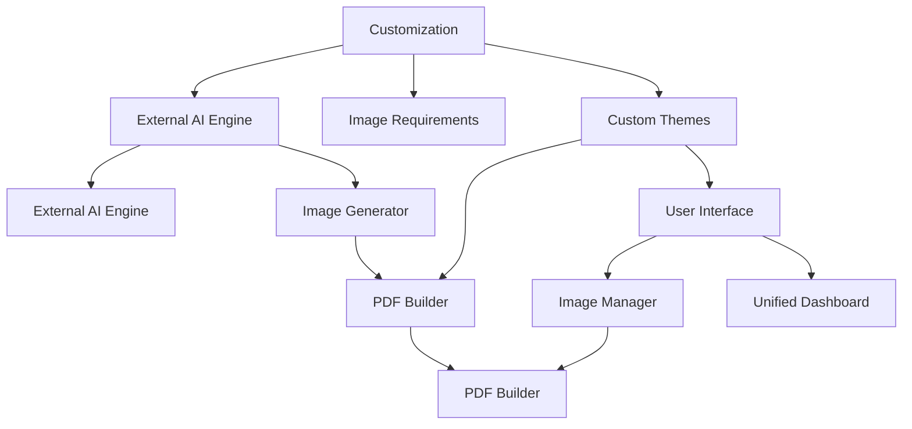

# Journal Crew AI Image Inference System Implementation Plan
## Advanced Computer Vision Integration for Journal Project Generation

---

## 🎯 **SYSTEM OVERVIEW**

### **Core Concept**
Create an integrated image inference system that combines:
- **AI-generated image prompts** from content curator agent
- **External AI inference** for custom image generation
- **Dynamic prompt optimization** based on content analysis
- **Batch processing** for efficient 30-day journal generation
- **User-uploaded image integration** with AI enhancement
- **Position-based image management** for perfect placement

---

## 🏗 **TECHNICAL ARCHITECTURE**

### **Component Breakdown**


### **Database Schema**
```python
# New models for image inference
class ImagePrompt(BaseModel):
    id: int
    journal_id: int
    position: str  # "cover_30dayjournal", "day1_full", "intro_right"
    prompt: str
    optimized_prompt: str
    content_type: str  # "cover", "full_page", "bottom", "certificate"
    generation_config: dict
    status: str  # "pending", "generating", "completed", "failed"
    created_at: datetime
    generated_at: Optional[datetime]

class AIImageGeneration(BaseModel):
    id: int
    prompt_id: int
    model: str  # "dall-e-3", "midjourney", "stable-diffusion", "custom"
    parameters: dict
    generated_url: str
    local_path: str
    cost: float
    status: str
    generation_time: int  # seconds
    created_at: datetime

class UserUploadedImage(BaseModel):
    id: int
    user_id: int
    journal_id: int
    original_filename: str
    file_path: str
    file_size: int
    mime_type: str
    upload_date: datetime
    processed_date: Optional[datetime]
    ai_enhanced: bool
    enhancement_id: Optional[int]
```

### **API Endpoints**
```python
# Image inference system endpoints
@app.post("/api/image-inference/prompt-optimizer")
@app.post("/api/image-inference/generate-batch")
@app.post("/api/image-inference/external-ai")
@app.post("/api/image-inference/upload")
@app.post("/api/image-inference/enhance")
@app.get("/api/image-inference/status/{job_id}")
@app.post("/api/image-inference/cancel/{job_id}")
@app.get("/api/image-inference/templates")
```

---

## 🚀 **PHASE 1: CORE INFERENCE ENGINE (Weeks 1-2)**

### **1.1 Prompt Optimization Service**
```python
class PromptOptimizerService:
    def __init__(self, llm: LLM):
        self.llm = llm

    def analyze_content_context(self, journal_content: dict, position: str):
        """Analyze journal content to optimize image prompts"""
        # Content analysis for visual style
        # Emotional tone assessment
        # Theme consistency checking
        # Content type identification

    def optimize_image_prompt(self, base_prompt: str, context: dict, position: str):
        """Enhance base prompt with contextual information"""
        # Add theme-specific elements
        # Include emotional guidance
        # Style consistency enforcement
        # Position-specific optimization

    def generate_prompt_variants(self, optimized_prompt: str, count: int = 3):
        """Generate multiple prompt variations"""
        # Create diversity in AI generation
        # A/B testing capability for future

    async def save_optimized_prompts(self, job_id: int, prompts: List[str]):
        """Save optimized prompts for batch processing"""
```

### **1.2 External AI Integration Service**
```python
class ExternalAIEngineService:
    def __init__(self):
        self.config = self.load_ai_providers()

    async def generate_with_dall_e(self, prompt: str, options: dict):
        """Generate image using DALL-E 3"""

    async def generate_with_midjourney(self, prompt: str, style: str):
        """Generate image using Midjourney API"""

    async def generate_with_stable_diffusion(self, prompt: str, parameters: dict):
        """Generate image using Stable Diffusion"""

    async def get_supported_providers(self):
        """Return list of available AI providers"""

    async def monitor_costs(self, user_id: int):
        """Track AI generation costs and budgets"""
```

### **1.3 Batch Processing Engine**
```python
class BatchProcessingEngine:
    def __init__(self, prompt_optimizer: PromptOptimizer, ai_engine: ExternalAIEngineService):
        self.prompt_optimizer = prompt_optimizer
        self.ai_engine = ai_engine

    async def process_image_requirements_batch(self, journal_id: int):
        """Process all image requirements for a journal"""

    def create_generation_job(self, journal_id: int, requirements: List[dict]):
        """Create background job for batch image generation"""

    async def monitor_batch_progress(self, job_id: int):
        """Track progress of batch image generation"""

    async def optimize_job_execution(self, job_id: int):
        """Optimize prompts and execution order for efficiency"""
```

### **1.4 User Upload Integration**
```python
class UserImageService:
    def __init__(self, db: AsyncSession, file_storage: FileStorage):
        self.db = db
        self.file_storage = file_storage

    async def process_user_upload(self, user_id: int, file: UploadFile, journal_id: int):
        """Process user-uploaded images"""

    def analyze_upload_quality(self, image_path: str):
        """Analyze image quality and suggest improvements"""

    async def enhance_with_ai(self, image_path: str, enhancement_config: dict):
        """Enhance user images with AI processing"""

    async def integrate_to_journal(self, enhanced_image_path: str, journal_id: int, position: str):
        """Integrate enhanced image into journal project"""
```

---

## 🎨 **PHASE 2: USER INTERFACE (Weeks 2-3)**

### **2.1 Image Inference Dashboard**
```typescript
// React component for managing AI image generation
<ImageInferenceDashboard>
  <PromptOptimizer />
  <AIProviderSelector providers={AI_PROVIDERS} />
  <BatchProcessor journalId={journalId} />
  <ProgressMonitor jobIds={activeJobs} />
  <UserUploader journalId={journalId} />
  <ImageGallery images={generatedImages} />
  <PreviewPanel selectedImage={selectedImage} />
</ImageInferenceDashboard>
```

### **2.2 Template Management System**
```typescript
// Reusable image templates for different journal types
class ImageTemplateManager:
    templates = {
        "mindfulness": {
            "cover": "Zen nature scenes",
            "full_page": "Meditative prompts",
            "bottom": "Natural patterns"
        },
        "productivity": {
            "cover": "Clean office setups",
            "full_page": "Organizational layouts",
            "bottom": "Productivity graphics"
        },
        "creativity": {
            "cover": "Artistic expression",
            "full_page": "Inspirational quotes",
            "bottom": "Creative elements"
        }
    }

    def get_template_for_theme(self, theme: str, content_type: str):
        return self.templates.get(theme, self.templates["mindfulness"])
```

### **2.3 Real-Time Progress Tracking**
```typescript
// WebSocket-based real-time updates
const ImageGenerationProgress = {
  jobProgress: Map<jobId, JobProgress>,
  estimatedTimeRemaining: (jobId: string) => number,
  stage: string,
  errors: Array<string>,
  creditsUsed: number
}

// WebSocket connection
const useImageGenerationWebSocket = (jobId: string) => {
  onProgress: (progress: JobProgress) => updateProgress(jobId, progress),
  onComplete: (result: JobResult) => handleGenerationComplete(jobId, result),
  onError: (error: string) => handleGenerationError(jobId, error)
}
```

---

## 🎨 **PHASE 3: QUALITY CONTROL (Weeks 3-4)**

### **3.1 Quality Assessment Engine**
```python
class ImageQualityAssessment:
    def __init__(self):
        self.quality_models = self.load_assessment_models()

    def assess_ai_generated_image(self, image_path: str, prompt: str):
        """Assess AI generated image quality"""
        # Composition analysis
        # Color harmony checking
        # Theme consistency validation
        # Text readability verification

    def assess_enhanced_image(self, original_path: str, enhanced_path: str):
        """Compare before/after enhancement quality"""
        # Improvement measurement
        # Recommendation generation

    def generate_quality_report(self, assessment_results: dict):
        """Create detailed quality report with recommendations"""
```

### **3.2 Cost Optimization Engine**
```python
class CostOptimizer:
    def __init__(self):
        self.ai_costs = self.load_pricing_data()

    def optimize_generation_strategy(self, requirements: List[dict]):
        """Choose most cost-effective generation methods"""
        # Model selection based on complexity
        # Batch processing optimization
        # Local vs cloud cost analysis

    def track_usage_costs(self, user_id: int, generation_job: AIImageGeneration):
        """Track and optimize per-user and per-project costs"""

    def set_budget_limits(self, user_id: int, budget: float):
        """Implement cost controls and warnings"""
```

### **3.3 Consistency Checker**
```python
class ConsistencyChecker:
    def check_theme_consistency(self, images: List[str], theme: str):
        """Ensure all images match theme guidelines"""
        # Color palette compliance
        # Style guide adherence
        # Brand consistency verification

    def check_content_relevance(self, image_path: str, journal_content: dict):
        """Verify image matches associated text content"""
        # Semantic similarity analysis
        # Emotional tone matching
```

---

## 🎯 **PHASE 4: PROFESSIONAL FEATURES (Weeks 4-5)**

### **4.1 Advanced Model Management**
```python
class ModelManager:
    def __init__(self):
        self.available_models = self.load_model_catalog()
        self.performance_metrics = {}

    async def load_balanced_model(self, requirements: dict):
        """Choose optimal model for current demand"""
        # Load balancing based on queue size
        # Performance monitoring
        # Automatic fallback handling

    def update_model_performance(self, model_id: str, performance_data: dict):
        """Track model performance for optimization"""

    def get_model_recommendations(self, image_type: str, quality_requirements: dict):
        """Suggest best models for specific use cases"""
```

### **4.2 Professional Grade Models**
```python
# Support for high-end commercial applications
class ProfessionalModelService:
    models = {
        "dall_e_3": {"max_resolution": "1024x1024", "quality": "professional"},
        "midjourney_v6": {"style_consistency": "high", "artistic_quality": "premium"},
        "stable_diffusion_xl": {"customization": "extensive", "control": "precise"}
    }

    async def generate_commercial_image(self, brief: dict, model: str):
        """Generate high-end commercial images"""
        # Professional quality standards
        # Consistent style application
        # Technical specifications compliance
```

---

## 📊 **PERFORMANCE & MONITORING**

### **Key Performance Metrics**
```python
# System targets
PERFORMANCE_TARGETS = {
    "image_generation_time": "< 30 seconds for standard",
    "batch_processing": "100 images per hour",
    "cost_per_image": "< $0.10 average",
    "quality_score": "> 90% acceptance rate",
    "system_uptime": "99.9%",
    "api_response_time": "< 200ms average"
}
```

### **Scalability Architecture**
```python
# Distributed image generation system
class ScalableInferenceCluster:
    def __init__(self):
        self.nodes = self.initialize_worker_nodes()
        self.queue_manager = RedisQueueManager()
        self.cache_manager = DistributedCache()

    async def distribute_generation_job(self, job: AIImageGeneration):
        """Distribute AI image generation across multiple workers"""
        # Intelligent load balancing
        # Failover and retry mechanisms
        # Cost optimization across regions

    def monitor_system_performance(self):
        """Real-time performance monitoring"""
```

---

## 🚀 **IMPLEMENTATION TIMELINE**

### **Week 1-2**: Core Inference Engine
- Day 1-3: Prompt optimization and external AI integration
- Day 4-7: User upload system and quality assessment
- Day 8-14: Template system and real-time progress
- Day 15-21: Batch processing and cost optimization

### **Week 3**: Quality & Performance
- Day 22-28: Professional models and consistency checking
- Day 29-35: Advanced features and monitoring

### **Week 4**: Scalability & Production
- Day 36-42: Distributed system and optimization
- Day 43-49: Final testing and deployment

---

## 🎯 **BUSINESS INTEGRATION**

### **Revenue Streams**
```
1. AI Generation Credits: Pay-per-use for premium models
2. Subscription Plans: Tiered access to advanced features
3. Template Marketplace: Sell curated image templates
4. Commercial Services: High-end image generation for enterprise clients
5. API Access: External access to your inference capabilities
```

### **Cost Management**
```
AI_CREDIT_COSTS = {
    "dall_e_3": "$0.04 per image",
    "midjourney": "$0.08 per image",
    "stable_diffusion": "$0.01 per image"
}

OPERATIONAL_COSTS = {
    "infrastructure": "$500/month",
    "development": "$8,000/month",
    "api_costs": "$200/month"
}
```

This system will transform your Journal Crew into a **professional-grade AI image generation service** that can support both your internal journal creation needs and external commercial requirements.

**Ready for detailed implementation planning and resource allocation!** 🚀